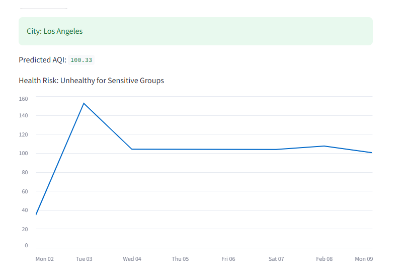

# Air Quality & Health Risk Assessment System
An end-to-end Machine Learning powered web application that monitors Air Quality Index (AQI), analyzes pollution trends, and predicts associated health risk levels for selected cities.
This project integrates data engineering, model development, explainability, and web deployment into a complete production-style ML pipeline.

## Overview

This project predicts Air Quality Index (AQI) for major global cities using pollutant and weather data.
It assesses health risk levels and visualizes historical AQI trends.

This is my first end-to-end ML system integrating:

- Machine Learning
- FastAPI
- PostgreSQL
- Streamlit
- Cloud Deployment (Render)

This system:

- Retrieves AQI data from a structured database
- Visualizes pollution trends using interactive line charts
- Predicts health risk levels using Machine Learning
- Provides interpretable insights for decision-making

The goal of this project is not only prediction, but building a **real-world deployable ML system**.

## Live Demo
Frontend:
[https://air-quality-health-risk-1.onrender.com](https://air-quality-health-risk-1.onrender.com/)

Backend Docs:
[https://air-quality-health-risk.onrender.com/docs](https://air-quality-health-risk.onrender.com/)

## Visualizations

- AQI Line Chart by Selected City
- Date-based trend visualization (timestamp converted to date for clarity)
- Interactive filtering by city

## Tech Stack

| Layer | Technology |
|-------|------------|
| Backend | Python |
| ML | Scikit-learn, XGBoost |
| Data Handling | Pandas, NumPy |
| Visualization | Streamlit, PowerBI |
| Database | PostgreSQL |
| Deployment | Render |
| Version Control | Git & GitHub |

## Future Improvements

- Add SHAP-based model explainability
- Add time-series forecasting (LSTM / Prophet)
- Implement API endpoint
- Containerization using Docker
- CI/CD pipeline integration

If you found this useful
Give this repository a star ⭐ and feel free to connect!
